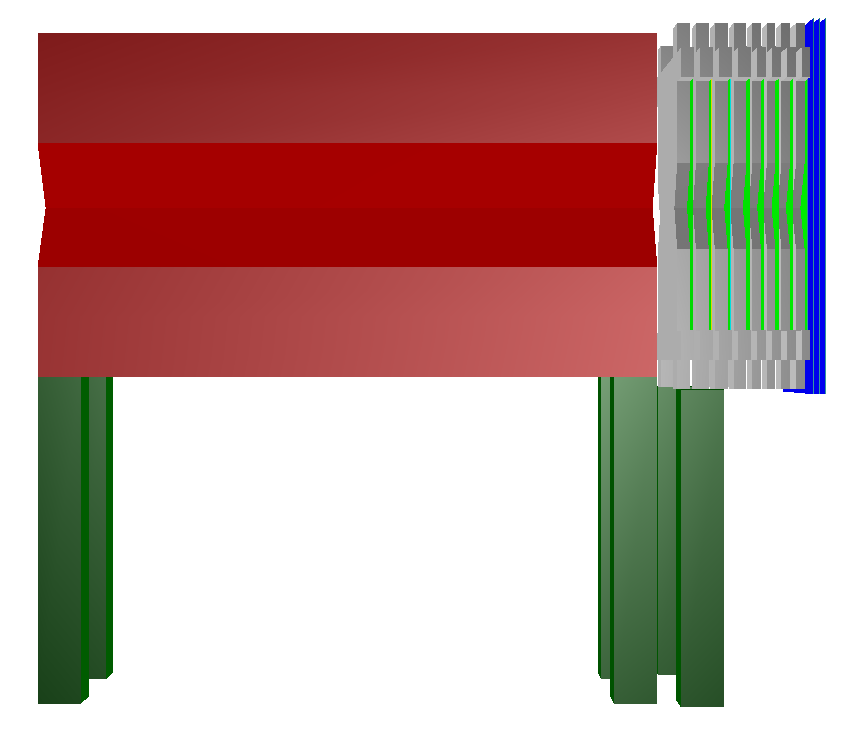

# FairShip geometry

## Introduction

FairShip is built from the FairRoot software framework ([https://fairroot.gsi.de/](https://fairroot.gsi.de/))

&#x20;Geometry works with C++ classes for various subdetectors, using ROOT geometry definitions of volumes&#x20;




&#x20;The PyROOT scripts act as interface, calling the methods from the C++ class

&#x20;Concerning the FairShip implementation, an old but still unvaluable guide was done by Annarita at the 7th SHiP Collaboration meeting: [https://indico.cern.ch/event/482695/contributions/1159354/attachments/1226721/1796262/DetectorTutorial.pdf](https://indico.cern.ch/event/482695/contributions/1159354/attachments/1226721/1796262/DetectorTutorial.pdf). The most elementar steps are the following ones:

* Each detector has a C++ Detector class, defined by a .cxx and .h file;
* There is an additional DetectorPoint class, for hit saving (usually they are written in the same template, only names are changed) and it may be present a DetectorHit class, for digitization (not in nutaudet though);
* Geometry parameters  are defined as class attributes, and passed with methods from the `geometry/geometry_config.py`. Using actual numbers in the code is confusing and heavily discouraged (but it unfortunately still happens sometimes;
* The `python/shipDet_conf.py` script is the one which actually builds the geometry, istantiating the objects and calling their methods.


&#x20;As the design of the SHiP experiment has become more realistic, we have gradually replaced uniform magnetic fields with field maps. Please see [https://github.com/ShipSoft/FairShip/blob/master/field/README.md](https://github.com/ShipSoft/FairShip/blob/master/field/README.md) for details


## Geometry FAQ

### TGeoShape composite crashes

Check that the component names are registered with RegisterYourself()

### TGeoVolume Issues

#### White single volume

It often happens that I am puzzled when a volume is white, and all replicas are brown.

The answer is simple: no linecolor was set! Set linecolor to a value and it will fix it :)

#### Bounding Box Not Valid

some volume has 0 size!. Do some InspectShape()!

#### Overlaps/Extrusions

Use gGeoManager->CheckOverlaps() to check them gGeoManager->PrintOverlaps() to have more details.

Note: overlaps are often the reason for **unexplained missing MCPoints in a otherwise working detector volume**

## nutaudet geometry

The `nutaudet` folder is the one dedicated to the $$\nu/i$$ SHiP detector. It is made of the following components:

* EmuMagnet  class;
* Target class;
* TargetTracker class;
* Hpt class (SciFi, structure very similar to Target Trackers);
* NuTauMudet class, for the muon identification system;

There are 4 design configurations, due to the changes done in time and different alternatives. The one we are currently using is design 3:

&#x20;   0\. Technical Proposal;

1. &#x20;new magnet option for short muon shield;
2. no magnet surrounding neutrino detector;
3. current with magnet, not magnetized muon filter


By default, the `Target` detector is passive, to save space in the produced simulation file. If we want to make it active, we need to change nuTargetPassive = 1 to nuTargetPassive = 0 in `geometry/geometry_config.py. This allows us to record TargetPoint hits`


Current configuration display, as of my git branch:

[https://github.com/antonioiuliano2/FairShip/tree/nutaumergeAlexander](https://github.com/antonioiuliano2/FairShip/tree/nutaumergeAlexander)



#### Magnetic field

Magnetic field is implemented as a field map, converted from a txt file to a ROOT file, as explained in the Readme in the `field` folder. The ROOT file itself can be checked to look at field components, but the positions are defined in the local reference system of magnet volume. To look at how appears in the global simulation, a function can called from \`run\_simScript.py\`:

```python
fieldMaker.plotField(1, ROOT.TVector3(-9000.0, 6000.0, 50.0), ROOT.TVector3(-300.0, 300.0, 6.0), 'Bzx.png')
```

Only few options available by default, but they can be added in the `field/ShipFieldMaker.cxx` script. The magnetic field map used currently for the nutaudet is defined in `files/nuTauDetField.root` and it implements a magnetic field of about 1.25 T, directed along x, in the emulsion target region.

## charmdet geometry

The `charmdet` folder is the one dedicated to the SHiP-charm and SHiP-muonflux detector configurations. Both configurations share the same structure, since both runs were hosted in the same facility (H4, CERN North area), and in the same period (end of July 2018).

#### Classes currently used by charm simulation:

* `Box` class: Emulsion Target;
* `Spectrometer` class: Pixel and SciFi detectors;
* `MufluxSpectrometer class:` Goliath Structure and Drift Tubes T3 and T4;
* `MuonTagger` class: RPCs for muon identification

#### Classes currently used by muon flux simulation:

* `MufluxSpectrometer` class: Tracking station T1 through T4;
* `MuonTagger` class: RPCs for muon identification;
* `Scintillator` class: drift tube trigger scintillators (i.e. S2);
* `ReProcessAbsorber`


```
```


