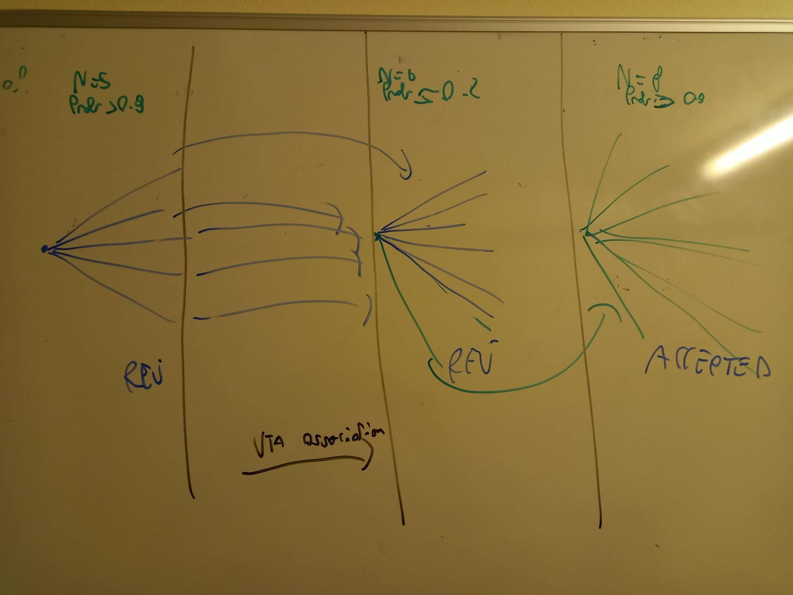

# Vertexing basics

There is a do\_vertex() call, which uses some parameters:

namespace VERTEX\_PAR { float DZmax = 3000.; // maximum z-gap in the track-vertex group float ProbMinV = 0.0001; // minimum acceptable probability for chi2-distance between tracks float ImpMax = 15.; // maximal acceptable impact parameter [microns](https://app.gitbook.com/s/-LiljZk5ehnnqRwtziNL/fedra/for%20preliminary%20check) bool UseMom = false; // use or not track momentum for vertex calculations bool UseSegPar = true; // use only the nearest measured segments for vertex fit (as Neuchatel) int QualityMode= 0; // vertex quality estimation method (0:=Prob/(sigVX^2+sigVY^2); 1:= inverse average track-vertex distance) }

the do\_vertex simply loads these parameters in a EdbVertexRec object (defined in the EdbVertex.h class), which then starts finding the 2-tracks vertices, with gEVR->FindVertex();

Then it will add tracks to these 2 tracks-vertices, with a ProbVertexN() method.

Let's see what it does:

## FindVertex()

First it looks for tracks starts and ends (Note: EdbTrackP is defined in EdbPatternh), with void EdbVertexRec::FillTracksStartEnd(TIndexCell \&starts, TIndexCell \&ends ) this justs gets the start and the end of the track

Then the 'fun' part starts -> LoopVertex()! It will look for three types of vertex: begin begin, end begin and end end

It will check that z2 > z1 (sorting to avoid compare the same tracks twices) and that z2 - z1 <= DZMax Then it will use TrackP pointers to access the TrackP objects Ok, so far, so good

Do we have a vertex? Ask ProbVertex2(tr1, tr2, zpos1, zpos2)

If we have a vertex, this function will return the pointer to the vertex If not, it will return 0

Note: it requires a lot of time, why? Check if is ProbVertex or the combination before -> use  clock()


## Vertex Probability

Probability of the vertex is computed from the prob() method of the associated Vertex instance (libVt++ class). The probability is computed as CERN\_prob(chi2(), ndf()), where

ndf() = 2\*ntracks()-3\


A track can belong to multiple vertices in the initial stage. Later, it will be associated to the vertex with the highest rank, computed as 10\*ntracks + probability.

If all tracks from a vertex have been moved to a better vertex, the vertex becomes "empty" and without meaning -> its flag is then -10, which means good vertices to be analyzed **must have flag larger than 0.**&#x20;

In high multiplicity environments, it may happen that tracks "disappear", due to having been associated to two vertices with flag -10, without finding a final vertex, even with low multiplicity. The, **still experimental, but used in sndsw simulation, RECOVERCHECKVTX()** function fixes this (see schematics of the issue):

<figure><figcaption><p>Luckily I did this drawing at CERN XD</p></figcaption></figure>

## LinkedVertexes()

Vertices can be linked: that is, a track can start from a vertex and end to another vertex, acting as a bridge to another vertex.

The number of linked vertices is returned by the EdbVertex::Nv() function. If this number is larger than 0, flag number is added by 3 (see vertex tree structure for vertex flag meaning)

## Vertex Neighbor, VertexTuning()

A single vertex with high multiplicity may be separated into many vertices with lower multiplicities. In this case, user can select vertex neighborhood - other vertices, tracks and segments, which passed close to a vertex (pointers to these objects will be stored in vertex object):

```
EdbVertexRec::VertexNeighbor( EdbVertex *v, RadMax, Dpat, ImpMax);
```

Where:

* v is pointer to vertex;
* RadMax is maximal track(segment) - vertex distance in X-Y plane;
* DPat is number of adjacent patterns for selection;
* ImpMax maximal impact parameter (for tracks only);

Procedure:

```
EdbVertexRec::VertexNeighbor( RadMax, Dpat, ImpMax);
```

Will do it all for all existing vertices. They then can be tuned with:

```
EdbVertexRec::VertexTuning( int Criteria_type );
```

This procedure will work with pairs of vertexes in neighborhood and try to improve vertexing - remove worsest track (maximal impact or maximal chi2 contribution) from one vertex and add it to other. If new criteria for pair better that original one, we acccept new vertexes. If Criteria\_type=0, criteria is sum of vertexes average impact parameters, if Criteria\_type=1, criteria is sum of vertexes chi2.

\
