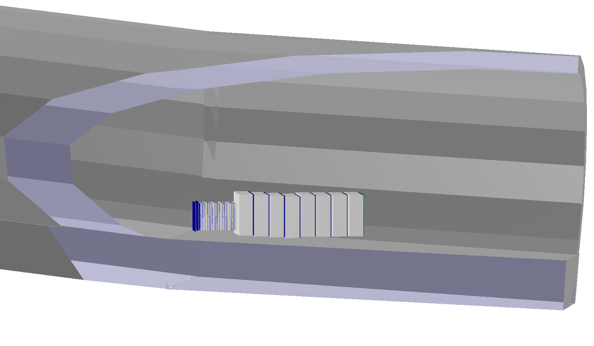

# Sndsw geometry

## Introduction

The **shiplhc** folder is the one dedicated to SND@LHC. It is made of the following components:

* EmulsionDet class;
* SciFi class;
* MuFilter class \(also containing veto\);

## Geometry classes and functions

Each component of the SND@LHC detector has its own geometry class.

 The **ConstructGeometry\(\)** function contains the required geometry objects and commands which describe our geometry. The geometry employs classes and methods from ROOT TGeo \([https://root.cern/manual/geometry/](https://root.cern/manual/geometry/)\). The following information are needed:

* Material and medium definitions
* Shape of the detector component
* Position of the volume in the overall geometry

### Material and medium

To create any volume, the medium information is needed. The **TGeoMaterial** describes the properties of the material \(A,Z, density\), and the TGeoMedium uses this information as input to store the tracking parameters.

It is practical to store all needed media in a dedicated **geometry/media.geo** file. For mixtures, each property is defined for all components one by one.

Various medium definitions can be applied, according to the different properties required. The syntax of medium definitions is inherited from the FairROOT framework: [https://fairroot.gsi.de/?q=node/34](https://fairroot.gsi.de/?q=node/34).

Media are extracted from the **$FAIRSHIP/geometry/media.geo** file through the **InitMedium\(\)** function, defined for each detector class

### Shapes

Shapes are geometrical objects that provide the basic modeling functionality. They define the local coordinate system. ROOT provides us with a set of basic shapes, also called primitives. TGeoBBox is just an example. There are shapes for sheres, trapezoids, and many others.

Of course the parameters needed depend on the shape: try to launch root **$ROOTSYS/tutorials/geom/geodemo.C** to learn about the various possibilities.

However, as soon as your detector becomes more realistic, the primitive shapes are not sufficient anymore. ROOT provides TGeoCompositeShape, to combine shapes with boolean operations:

* **Union \(+\): A+B**
* **Subtraction \(-\): A - B**
* **Intersection \(\*\): A \* B**

By defaults, shapes are positioned with an identity trasformation with respect to the frame of the created composite. 

This can be changed by defining a TGeoRotation and/or a TGeoTranslation and applying them to the shape with the symbol "**:"** . For example: 

`(A:t1) + (B:t2)`

It will execute the union of shape A and shape B, after applying transformations t1 and t2 respectively.

### Volume positioning

After defining a shape and a medium, a TGeoVolume object can be instantiated

```cpp
TGeoVolume *fBoxVol = new TGeoVolume("volBox", fBox, Fe);
```

Except for the top volume, all the volumes are positioned within the reference of a mother volume, following a volume hierarchy based on containment \(each volume inside a bigger one\).

We need to define a local geometrical transformation of the daughter with respect to the mother coordinate system. Then, we can positionate the volume:

```cpp
TGeoTranslation *fT = new TGeoTranslation(fTx, fTy, fTz); top -> AddNode(fBoxVol, 1, fT);
```

The number 1 between fBoxVol and fT is the number of the replica. Replicas allow to instantiate many identical volumes in different positions, for example detector planes.


 ****

   


## Event display

EventDisplay is launched with a similar macro of the FairShip one:

```text
python -i $SNDSW/macro/eventDisplay_shipLHC.py -f simulationfile.root -g geofile.root
```

It will show the tunnel with the detector and all components:

* Hide all components except the tunnel with SND;
* Go to Guides -&gt; select center -&gt; pick center -&gt; select SND with mouse;
* Go to Clipping -&gt; select plane -&gt; select Edit in Viewer;
* Set aX+ = -1.0 , bX+ = 0.
* Set d = -220 and click Apply
* ROOT.gGeoManager.SetNsegments\(80\) to make picture more smooth

Something like this should appear:



 

