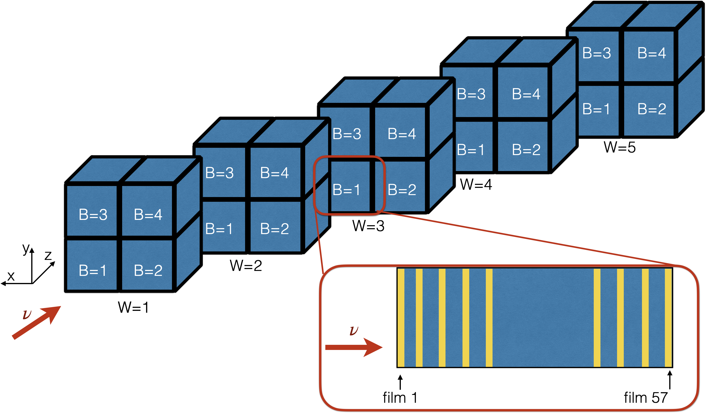

# Sndsw geometry

## Introduction

The **shiplhc** folder is the one dedicated to SND@LHC. It is made of the following components:

* EmulsionDet class;
* SciFi class;
* MuFilter class (also containing veto);

## Geometry classes and functions

Each component of the SND@LHC detector has its own geometry class.

Each detector is defined by a C++ class, with both header (.h) and script (.cxx) file in the same folder. It inherits from one of the two following classes, provided by FairROOT:

* **FairModule**: Defines a geometry element which does not produce MC points (all passive volumes)
* **FairDetector**: Defines a geometry element with active volumes (e.g. a detector), it contains extra fuctions for MC simulations.

Basic class structure is very similar for all detectors, we will cover here only the most important methods that must be customized for your class.

&#x20;The **ConstructGeometry()** function contains the required geometry objects and commands which describe our geometry. The geometry employs classes and methods from ROOT TGeo ([https://root.cern/manual/geometry/](https://root.cern/manual/geometry/)). The following information are needed:

* Material and medium definitions
* Shape of the detector component
* Position of the volume in the overall geometry

### Material and medium

To create any volume, the medium information is needed. The **TGeoMaterial** describes the properties of the material (A,Z, density), and the TGeoMedium uses this information as input to store the tracking parameters.

It is practical to store all needed media in a dedicated **geometry/media.geo** file. For mixtures, each property is defined for all components one by one.

Various medium definitions can be applied, according to the different properties required. The syntax of medium definitions is inherited from the FairROOT framework: [https://fairroot.gsi.de/?q=node/34](https://fairroot.gsi.de/?q=node/34).

Media are extracted from the **$FAIRSHIP/geometry/media.geo** file through the **InitMedium()** function, defined for each detector class

### Shapes

Shapes are geometrical objects that provide the basic modeling functionality. They define the local coordinate system. ROOT provides us with a set of basic shapes, also called primitives. TGeoBBox is just an example. There are shapes for sheres, trapezoids, and many others.

Of course the parameters needed depend on the shape: try to launch root **$ROOTSYS/tutorials/geom/geodemo.C** to learn about the various possibilities.

However, as soon as your detector becomes more realistic, the primitive shapes are not sufficient anymore. ROOT provides TGeoCompositeShape, to combine shapes with boolean operations:

* **Union (+): A+B**
* **Subtraction (-): A - B**
* **Intersection (\*): A \* B**

By defaults, shapes are positioned with an identity trasformation with respect to the frame of the created composite.&#x20;

This can be changed by defining a TGeoRotation and/or a TGeoTranslation and applying them to the shape with the symbol "**:"** . For example:&#x20;

`(A:t1) + (B:t2)`

It will execute the union of shape A and shape B, after applying transformations t1 and t2 respectively.

### Volume positioning

After defining a shape and a medium, a TGeoVolume object can be instantiated

```cpp
TGeoVolume *fBoxVol = new TGeoVolume("volBox", fBox, Fe);
```

Except for the top volume, all the volumes are positioned within the reference of a mother volume, following a volume hierarchy based on containment (each volume inside a bigger one).

We need to define a local geometrical transformation of the daughter with respect to the mother coordinate system. Then, we can positionate the volume:

```cpp
TGeoTranslation *fT = new TGeoTranslation(fTx, fTy, fTz); top -> AddNode(fBoxVol, 1, fT);
```

The number 1 between fBoxVol and fT is the number of the replica. Replicas allow to instantiate many identical volumes in different positions, for example detector planes.

### Processing MonteCarlo hit points (FairMCPoints)

The **ProcessHits()** method defined in the detector class tells the MC which information you want to be saved. It presents very similar implementations between classes. A significant difference is how the VolumeID is defined: by default, it adds the information from the replica number of the last volume to the mother volumes.

Each FairShip detector must have also a **DetPoint c**lass, to store the information from propagation of particles in the detector, during MC simulation: momentum, position, energy deposition... This class inherits from the **FairMCPoint** class

## Other geometry files

It is recommended to put all numerical parameters in the **$SNDSW/geometry/shipLHC\_geom\_config.py** file, instead of directly in the code which builds the detector. This gives two advantages:

* It is easier to check parameters and to debug them
* Changing a parameter does not require re-compiling the code (Notice: you still need to relaunch the alibuild command, to ensure the file is copied from the work directotry to the build directory).

The parameters are stored as attributes of each detector, and defined along with their units

Geometrical parameters from the **$SNDSW/geometry/shipLHC\_geom\_config.py** file are then passed to the various detector classes by the **$SNDSW/python/shipLHC\_conf.py** script

This script is the one actually responsible for building the geometry, and it is the one directly called by simulation macros, like **$SNDSW/macro/run\_simScript.py**

It is useful to list here the accessors from the FairMCPoint, they are the methods you usually have to call in your analysis script:

```cpp
/** Accessors */
UInt_t GetEventID() const { return fEventId; }
/// event identifier
Int_t GetTrackID() const { return fTrackID; }
Double_t GetPx() const { return fPx; }
Double_t GetPy() const { return fPy; }
Double_t GetPz() const { return fPz; }
Double_t GetTime() const { return fTime; }
Double_t GetLength() const { return fLength; }
Double_t GetEnergyLoss() const { return fELoss; }
void Momentum(TVector3& mom) const { mom.SetXYZ(fPx, fPy, fPz); }
Int_t GetDetectorID() const { return fDetectorID; };
Double_t GetX() const { return fX; };
Double_t GetY() const { return fY; };
Double_t GetZ() const { return fZ; };
void Position(TVector3& pos) const { pos.SetXYZ(fX, fY, fZ); }
```

The TrackID allows to match the hit in the detector with the particle which left it. Information about the  particles are stored in **$SNDSW/shipdata/ShipMCTrack:**

```cpp
/**  Accessors  **/
    Int_t    GetPdgCode()  const { return fPdgCode; }
    Int_t    GetMotherId() const { return fMotherId; }
    Double_t GetPx()       const { return fPx; }
    Double_t GetPy()       const { return fPy; }
    Double_t GetPz()       const { return fPz; }
    Double_t GetStartX()   const { return fStartX; }
    Double_t GetStartY()   const { return fStartY; }
    Double_t GetStartZ()   const { return fStartZ; }
    Double_t GetStartT()   const { return fStartT; }
    void SetProcID(Int_t i) { fProcID = i; }
    Int_t GetProcID()      const { return fProcID; }
    TString GetProcName()  const { return TMCProcessName[fProcID]; }
    Double_t GetMass()     const;
    Double_t GetEnergy()   const;
    Double_t GetPt()       const { return TMath::Sqrt(fPx*fPx+fPy*fPy); }
    Double_t GetP() const { return TMath::Sqrt(fPx*fPx+fPy*fPy+fPz*fPz); }
    Double_t GetRapidity() const;
    void MultiplyWeight(Double_t w) {fW = fW*w;}
    void SetWeight(Double_t w) {fW = w;}
    Double_t GetWeight()   const;
    void GetMomentum(TVector3& momentum);
    void Get4Momentum(TLorentzVector& momentum);
    void GetStartVertex(TVector3& vertex);
```

## Event display

EventDisplay is launched with a similar macro of the FairShip one:

```
python -i $SNDSW/macro/eventDisplay_shipLHC.py -f simulationfile.root -g geofile.root
```

It will show the tunnel with the detector and all components:

* Hide all components except the tunnel with SND;
* Go to Guides -> select center -> pick center -> select SND with mouse;
* Go to Clipping -> select plane -> select Edit in Viewer;
* Set aX+ = -1.0 , bX+ = 0.
* Set d = -220 and click Apply
* ROOT.gGeoManager.SetNsegments(80) to make picture more smooth

Something like this should appear:


## Emulsion scanning reference system


We scan the emulsions belonging to 20 bricks for each target. You can see the layout here:

<figure><figcaption><p>Layout,  with RUN0 brick enlarged</p></figcaption></figure>

The emulsions are installed with the label flipped and scanned with the label straight.&#x20;

The beam see **first the bottom layer**, **then the top layer**.&#x20;

The origin of B1 is in the intersection with B2, down.

The origin of B2 is the in bottom corner of the wall.

During scanning, origin is taken at the top right edge of emulsion (from scanner point of view, bottom left on the pc monitor)

Need to be sure if the gap between bricks in a wall is 0.5 cm or 0.5 m&#x6D;**!!**

&#x20;
